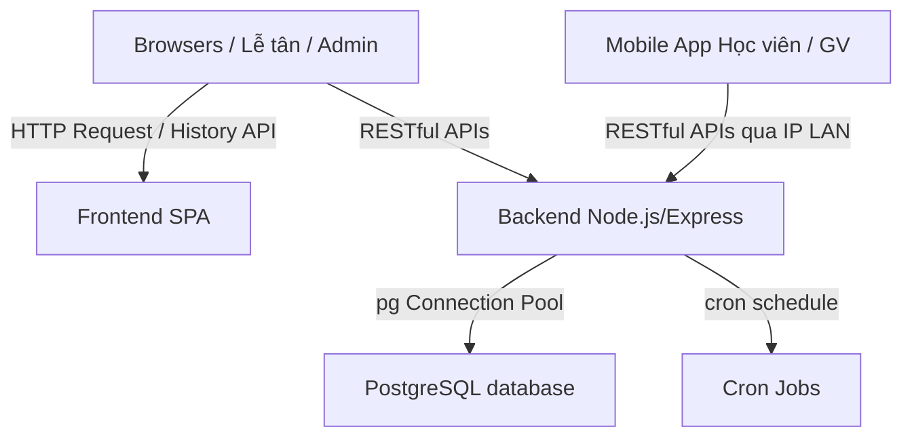

# KIẾN TRÚC HỆ THỐNG — CENTER MANAGEMENT SYSTEM

Hệ thống Quản lý Trung tâm Dạy học (Center Management System) được xây dựng theo mô hình Monorepo, bao gồm Backend (Express + PostgreSQL), Frontend Web SPA (Vanilla JS) và Mobile App (React Native + Expo).

---

## 1. Cấu Trúc Tổng Quan (Monorepo Architecture)

- **/backend**: Express server, các routes API xử lý logic nghiệp vụ và kết nối PostgreSQL Neon Cloud bằng thư viện `pg` qua query thuần. Cung cấp các tác vụ tự động chạy ngầm bằng `node-cron`.
- **/frontend**: Single Page Application (SPA) viết hoàn toàn bằng Vanilla JavaScript, định tuyến client-side bằng History API (`pushState`), style giao diện hiện đại sử dụng thư viện Tailwind CSS qua CDN.
- **/mobile**: Ứng dụng di động viết bằng React Native + Expo Go, gọi các RESTful API trực tiếp qua địa chỉ IP LAN để hỗ trợ Học viên (xem lịch học/học phí, sinh mã QR điểm danh), Giáo viên (xem lịch dạy, điểm danh, sinh mã QR chấm công) và Admin/Lễ tân (theo dõi nhật ký, camera quét mã QR).

---

## 2. Thiết Kế Cơ Sở Dữ Liệu (PostgreSQL Schema)

Hệ thống kế thừa và chuyển đổi từ Paradise Gym SQLite sang PostgreSQL, tập trung vào các bảng cốt lõi:
- **vai_tro** & **tai_khoan** & **ho_so**: Quản lý thông tin tài khoản và phân quyền người dùng (`admin`, `le_tan`, `giao_vien`, `hoc_vien`).
- **goi_hoc_phi** & **dang_ky_khoa_hoc**: Quản lý các gói học phí chung và thông tin đóng học phí của học viên.
- **goi_hoc_kem** & **dang_ky_hoc_kem**: Quản lý các gói dạy học kèm 1-1 hoặc lớp học nhỏ có số buổi đăng ký giới hạn.
- **lich_hoc**: Chi tiết từng buổi học (ngày, giờ, trạng thái điểm danh, xác nhận của GV và HV).
- **so_lien_lac**: Sổ liên lạc điện tử cập nhật bài học, nhận xét của giáo viên và bài tập về nhà.
- **thong_bao**: Chứa các thông báo hệ thống được tạo tự động bởi nhân viên hoặc các cron jobs.
- **v_trang_thai_hoi_vien**: View lọc trạng thái thời hạn gói học phí của học viên kèm mã màu trạng thái (`con_han`, `sap_het_han`, `het_han`, `chua_dang_ky`).
- **doanh_thu**: Bảng tích lũy doanh thu hàng ngày được cập nhật tự động bằng các Trigger (`trg_doanh_thu_khoa_hoc_update`,...).

---

## 3. Danh Sách Các RESTful API Endpoints

### 3.1. Luồng Điểm danh & Xác nhận buổi học
- **PUT `/api/attendance/:id`**
  - Mô tả: Giáo viên điểm danh trạng thái buổi học.
  - Body: `{ "trang_thai": "da_hoc" | "vang" | "da_huy" }`
  - Logic: Cập nhật `trang_thai` và đổi `da_checkin = 1`.
- **PUT `/api/attendance/:id/confirm`**
  - Mô tả: Giáo viên hoặc học viên xác nhận buổi học đã diễn ra.
  - Body: `{ "pt_xac_nhan": 1, "hv_xac_nhan": 1 }`
  - Logic (Transaction): Cập nhật xác nhận. Nếu cả 2 cùng bằng 1, thực hiện Transaction tăng số buổi đã dạy `so_buoi_da_hoc = so_buoi_da_hoc + 1` ở bảng `dang_ky_hoc_kem`.

### 3.2. Luồng Sổ liên lạc điện tử
- **POST `/api/reports`**
  - Mô tả: Giáo viên tạo nhật ký học tập cho buổi học.
  - Body: `{ "lich_hoc_id", "hoc_vien_id", "giao_vien_id", "noi_dung_bai_hoc", "nhan_xet_buoi_hoc", "bai_tap_ve_nha",... }`
- **GET `/api/reports/student/:studentId`**
  - Mô tả: Học viên/Phụ huynh lấy lịch sử sổ liên lạc theo dòng thời gian (`ORDER BY ngay_tao DESC`).

### 3.3. Luồng Hủy khóa học & Tự động trừ doanh thu
- **PUT `/api/registrations/:id/cancel`**
  - Mô tả: Lễ tân hủy đăng ký khóa học và hoàn trả học phí.
  - Body: `{ "so_tien_hoan": 1500000, "ly_do_huy": "Học viên xin rút học phí" }`
  - Logic (Transaction): Bọc câu lệnh UPDATE trạng thái = `'huy'` để trigger `trg_doanh_thu_khoa_hoc_update` hoạt động đồng bộ an toàn trên PostgreSQL.
- **PUT `/api/registrations/:id`**
  - Mô tả: Lễ tân cập nhật thông tin hoặc đổi gói khóa học đại trà đang hoạt động của học viên.
- **PUT `/api/registrations/tutoring/:id`**
  - Mô tả: Lễ tân cập nhật thông tin hoặc đổi gói dạy học kèm 1-1 đang hoạt động của học viên.

### 3.4. API Hỗ trợ UI Frontend
- **GET `/api/students`**: Lấy danh sách học viên từ View `v_trang_thai_hoi_vien`.
- **GET `/api/schedule/today`**: Lấy danh sách lịch học hôm nay từ bảng `lich_hoc` kèm thông tin học viên liên quan.
- **POST `/api/checkin-logs`**: Tạo lượt chấm công/quét vân tay thủ công cho giáo viên và nhân sự.
- **POST `/api/reports`**: Giáo viên tạo nhận xét sổ liên lạc / nhật ký cho học sinh.
- **GET `/api/reports/student/:studentId`**: Lấy lịch sử sổ liên lạc của học sinh theo thứ tự thời gian mới nhất.

### 3.5. Cổng thanh toán trực tuyến PayOS
- **POST `/api/payment/create-payment-link`**
  - Mô tả: Tạo link thanh toán VietQR qua cổng PayOS.
  - Body: `{ ho_so_id, goi_hoc_phi_id, goi_hoc_kem_id, tu_ngay, den_ngay, chi_nhanh_mua, returnUrl, cancelUrl }`
  - Logic: Lưu tạm một đơn đăng ký ở trạng thái `'huy'` (trạng thái chờ của Postgres), sinh `orderCode` ngẫu nhiên và gọi SDK PayOS để tạo link thanh toán VietQR.
- **GET `/api/payment/check-status/:orderCode`**
  - Mô tả: API kiểm tra trạng thái thanh toán (cho Frontend chạy Polling).
  - Logic: Tra cứu trạng thái trong DB local. Nếu chưa kích hoạt, chủ động gọi API PayOS kiểm tra. Nếu giao dịch đã thanh toán thành công (`PAID`), tiến hành cập nhật trạng thái đơn đăng ký thành `'dang_hoat_dong'`, đồng bộ doanh thu.
- **POST `/api/payment/webhook`**
  - Mô tả: Webhook xác thực chữ ký và nhận thông báo trạng thái thanh toán tự động từ PayOS.

---

## 4. Cơ Chế Hoạt Động Của Cron Jobs (`backend/cronjobs.js`)

1. **Tác vụ 1 (Chạy lúc 08:00 sáng hàng ngày)**:
   - Truy vấn View `v_trang_thai_hoi_vien` tìm học viên có `trang_thai_mau = 'sap_het_han'`.
   - Chèn thông báo mới vào bảng `thong_bao` với `loai = 'sap_het_han_goi_tap'`, dành cho `nhan_vien` (Lễ tân) xử lý gia hạn.
2. **Tác vụ 2 (Chạy lúc 22:00 tối hàng ngày)**:
   - Truy vấn `cau_hinh` lấy `gio_dong_cua` (mặc định 22:00).
   - Truy vấn `lich_hoc` tìm các buổi học trong ngày có trạng thái `cho_hoc`.
   - Cập nhật trạng thái thành `vang`, ghi lỗi vào ghi chú và chèn thông báo `loai = 'cron_tu_xac_nhan'` cho `admin` giám sát giáo viên quên điểm danh.

---

## 5. Định Tuyến & UI Single Page Application (SPA)

- **Client-Side Routing**:
  - Module `frontend/src/router.js` sử dụng History API (`history.pushState`) và lắng nghe sự kiện `popstate`.
  - Hàm `renderPage(path)` phân quyền theo biến `isLoggedIn` và `userRole` lưu trữ trong `localStorage`.
- **Role-based UI Rendering**:
  - Giao diện được cấu trúc dạng components thuần và tải dữ liệu động từ Backend API thông qua `fetch`.
  - Hỗ trợ **Trình giả lập vai trò (Role Simulator)** ở đầu trang giúp chuyển đổi nhanh chóng giữa `le_tan`, `giao_vien`, `admin`, `hoc_vien` để kiểm thử UI mà không cần qua cổng Auth đầy đủ.
